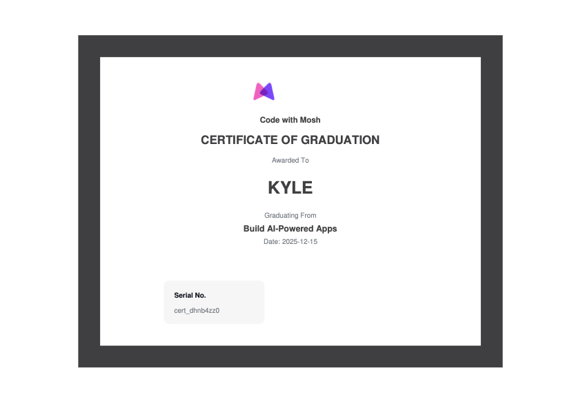

# AI Features Showcase
## Project Overview
It's clear that going forward, every software engineer will be expected to know how to work with AI models, just like other core competencies we're expected to know like working with databases. 

To kickstart my AI engineering learning journey, I took the "Build AI-Powered Apps" course from www.codewithmosh.com and built this AI Features Showcase project. I dedicated over 40 hours to learn these concepts and put them into practice by developing this full stack, AI powered web application from the ground up - no vibe coding involved whatsover. Some of the concepts covered in this project:

- Fundamentals of large language models (LLMs)
- Prompt engineering
- Modern full stack architecture (Bun, Express, React, MySQL, Tailwind, shadcn/ui)
- Implementing real, useful AI features into web applications
- Working with both commercial AND open source AI models
- Coding best practices

## Certificate of Completion



## AI Integration
After spending some time learning the fundamentals of LLMs, prompt engineering, and how to integrate AI in code, I built two AI features that are commonly seen in modern applications:

### 1. AI Chatbot (OpenAI GPT-4o-mini)

**Use Case:** Conversational customer support agent for a fictional business called Miller's Mountain Bikes

**Implementation:**
- Uses OpenAI's **Responses API** for stateful conversations
- Model: `gpt-4o-mini` (cost-effective, fast, high-quality)
- Temperature: 0.2 (consistent, less creative responses)
- Max tokens: 300 (concise answers)

**Conversation Context Management:**
- Client generates unique `conversationId` per session using `crypto.randomUUID()`
- Server tracks `conversationId → lastResponseId` mapping using an in-memory Map
- Each request includes `previous_response_id` to maintain context
- OpenAI automatically manages conversation history

**Implementation Note:**
For this learning project, conversation state is stored in an in-memory `Map<string, string>` rather than persisting to MySQL.

If this were a production app requiring features like conversation history or cross-session persistence, migrating to MySQL would be straightforward:
```typescript
// Current: In-memory Map
export const conversationRepository = {
  getLastResponseId(conversationId: string) {
    return conversations.get(conversationId);
  },
};

// Future: MySQL (same interface, different implementation)
export const conversationRepository = {
  async getLastResponseId(conversationId: string) {
    return prisma.conversation.findUnique({
      where: { id: conversationId }
    })?.lastResponseId;
  },
};
```

**Prompt Engineering:**
```typescript
// System prompt with dynamic context injection
const instructions = `
You are a customer support agent for Miller's Mountain Bikes.

Key information about the shop:
${shopInfo}  // Dynamically loaded from markdown file

Only answer questions related to Miller's Mountain Bikes.
Answer in a cheerful tone, like you are passionate about mountain biking.
Never make up information.
`;
```

**Code Example:**
```typescript
// packages/server/llm/client.ts
const response = await openAIClient.responses.create({
  model: 'gpt-4o-mini',
  instructions: chatPrompt,
  input: userMessage,
  temperature: 0.2,
  max_output_tokens: 300,
  previous_response_id: previousResponseId,  // Maintains context
});
```

### 2. Review Summarizer (Hugging Face Llama 3.1)

**Use Case:** Generate concise summaries of product reviews

**Implementation:**
- Uses **Llama 3.1 8B Instruct** (open-source model via Hugging Face)
- Zero cost for inference (open-source model)
- Privacy-friendly (can be self-hosted)

**Caching Strategy:**
- Summaries stored in database with expiration time (2 minutes)
- Prevents redundant API calls for the same product
- Automatically regenerates when expired

**Code Example:**
```typescript
// packages/server/llm/client.ts
const chatCompletion = await inferenceClient.chatCompletion({
  model: 'meta-llama/Llama-3.1-8B-Instruct:novita',
  messages: [
    { role: 'system', content: summarizePrompt },
    { role: 'user', content: joinedReviews },
  ],
});

// packages/server/services/review.service.ts
// Check for existing, non-expired summary before generating new one
const existingSummary = await reviewRepository.getReviewSummary(productId);
if (existingSummary) return existingSummary;

// Generate new summary and cache it
const summary = await llmClient.summarizeReviews(joinedReviews);
await reviewRepository.saveReviewSummary(productId, summary);
```

**Why Two Different Models?**
- **OpenAI (chatbot):** Requires high-quality, context-aware responses with conversation memory
- **Llama (summarization):** Simple text transformation task suitable for open-source models
- Demonstrates understanding of cost optimization and model selection

## Tech Stack

### Runtime & Build Tools
- **Bun** - Modern JavaScript runtime and package manager (faster than Node.js/npm)
- **TypeScript** - Type-safe JavaScript for both client and server
- **Vite** - Next-generation frontend build tool with lightning-fast HMR
- **Concurrently** - Run client and server in parallel during development

### Backend
- **Express** - Fast, minimalist web framework for Node.js
- **Prisma** - Type-safe database client with auto-generated types for easy object relational mapping
- **MySQL** - Relational database
- **Zod** - Schema validation for API requests
- **OpenAI SDK** - Client abstraction for easily integrating OpenAI LLMs
- **Hugging Face Inference** - Client abstraction for easily integrating open source LLMs
- **Day.js** - Simple date manipulation library

### Frontend
- **React 19** - Latest version of React with modern hooks and patterns
- **React Router DOM** - Declarative routing for single-page applications
- **TanStack Query** (React Query) - Powerful async state management for server data
- **Tailwind CSS** - Utility-first CSS framework for rapid UI development
- **shadcn/ui** - Third party component library for rapid UI development
- **React Hook Form** - Form validation
- **React Markdown** - Render markdown content in React components
- **Axios** - Promise-based HTTP client for API requests

## Architecture

### Monorepo Structure

This project uses a **monorepo architecture** powered by Bun workspaces, allowing both client and server to share configurations while maintaining clear separation of concerns.

**Benefits:**
- Single command (`bun run dev`) starts both client and server
- Shared TypeScript configuration and tooling
- Coordinated dependency management
- Faster development workflow

### Server Architecture

The backend follows a **layered architecture** pattern with clear separation of responsibilities.

**Controller Layer** - Acts as the application gateway:
- Routes incoming HTTP requests to appropriate handlers
- Validates request data using Zod schemas
- Formats HTTP responses
- Never contains business logic

**Service Layer** - Contains core business logic:
- Orchestrates complex operations across multiple repositories
- Integrates with external APIs (OpenAI, Hugging Face)
- Returns platform-agnostic data structures
- Remains testable and reusable

**Repository Layer** - Handles all data access:
- Encapsulates database queries using Prisma
- Provides clean interfaces that hide implementation details
- Enables easy swapping of data sources (e.g., MySQL → PostgreSQL)

This architecture ensures:
- **Testability** - Each layer can be tested in isolation
- **Maintainability** - Changes are localized to specific layers
- **Scalability** - Easy to add new features without breaking existing code

### Client Architecture

The frontend is a modern React application built with functional components and hooks:

**Key Patterns:**

**State Management:**
- `useState` for local component state
- `useRef` for persistent values that don't trigger re-renders (conversation IDs, scroll refs)
- `useEffect` for side effects (auto-scroll, theme changes)
- TanStack Query for server state (caching, refetching, mutations)
- React Context for global theme state

**Data Fetching:**
- TanStack Query `useQuery` for GET requests with automatic caching and retries
- TanStack Query `useMutation` for POST requests with optimistic updates
- Custom hooks isolate data fetching logic from UI components

**Styling:**
I created the base layout and styling first and then used **Claude Code** to quickly improve the look and feel after main application features were already in place.

- Tailwind utility classes for rapid development
- Dark mode support with `dark:` variant classes
- shadcn/ui for accessible, customizable components
- Responsive design with mobile-first breakpoints

### Database

**Schema Design (MySQL + Prisma):**

```prisma
model Product {
  id          Int       @id @default(autoincrement())
  name        String    @db.VarChar(255)
  description String?   @db.Text
  price       Float
  reviews     Review[]  // One-to-many relationship
  summary     Summary?  // One-to-one relationship
}

model Review {
  id        Int      @id @default(autoincrement())
  author    String   @db.VarChar(255)
  rating    Int      @db.TinyInt
  content   String   @db.Text
  createdAt DateTime @default(now())
  productId Int
  product   Product  @relation(fields: [productId], references: [id])
}

model Summary {
  id          Int      @id @default(autoincrement())
  productId   Int      @unique
  product     Product  @relation(fields: [productId], references: [id])
  content     String   @db.Text
  generatedAt DateTime @default(now())
  expiresAt   DateTime  // Cache invalidation strategy
}
```

**Design Decisions:**
- **Relational model** - Products have many Reviews; each Product has one Summary
- **Cache expiration** - Summaries have an `expiresAt` field to prevent stale AI-generated content
- **Type safety** - Prisma generates TypeScript types from the schema
- **Migration system** - Schema changes are versioned and reproducible

## Deployment

This application is deployed to **Railway** in production. For comprehensive deployment documentation, see **[DEPLOYMENT.md](./DEPLOYMENT.md)**, which includes:
- Platform & architecture overview
- Critical configuration files (`railway.json`, `nixpacks.toml`, Prisma binary targets)
- Environment variables setup
- Build & deployment process
- Express production configuration
- Database migration strategy
- Health checks & auto-deploy
- Rate limiting implementation
- Troubleshooting common issues
- Production best practices
- Cost estimates
